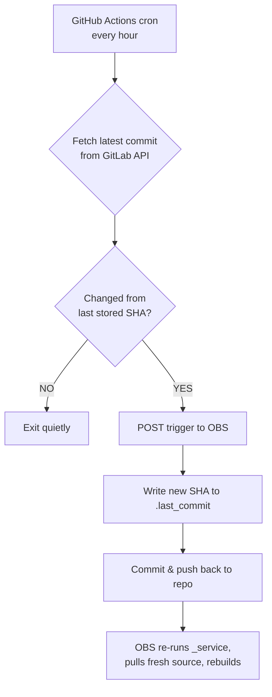

```markdown
# 🔄 openrgb-obs-watcher

[](https://github.com/itachi-re/openrgb-obs-watcher/actions/workflows/watch-and-build.yml)
[](https://build.opensuse.org/package/show/home:itachi_re/openrgb)
[](https://gitlab.com/CalcProgrammer1/OpenRGB)

Automatically trigger a rebuild of the [OpenRGB](https://gitlab.com/CalcProgrammer1/OpenRGB) package on the [openSUSE Build Service](https://build.opensuse.org) whenever a new commit lands on the upstream `master` branch.

---

## 📖 Table of Contents

- [Why this exists](#-why-this-exists)
- [How it works](#-how-it-works)
- [One‑time setup](#%EF%B8%8F-one-time-setup)
  - [1. Create the OBS token](#1--create-the-obs-token)
  - [2. Add GitHub Secrets](#2--add-github-secrets)
  - [3. Enable workflow write permissions](#3--enable-workflow-write-permissions)
  - [4. Push and you’re done](#4--push-this-repo-to-github-and-youre-done)
- [Repository files](#-repository-files)
- [Adjusting the schedule](#-adjusting-the-schedule)
- [Failure behaviour](#-failure-behaviour)
- [Links](#-links)

---

## 🤔 Why this exists

The OBS `_service` file (obs_scm) can re‑fetch the latest source, but OBS only runs the service when manually triggered or when the package changes.  
This tiny GitHub Actions workflow acts as a bridge: it **watches the upstream GitLab `master` branch hourly** and **pokes OBS** whenever a new commit appears, so the package always builds the very latest OpenRGB code without any manual intervention.

---

## ⚙️ How it works



1. The workflow fetches the `master` branch info from GitLab’s public API (no token needed).
2. It compares the returned `commit.id` with the SHA stored inside `.last_commit`.
3. **If unchanged** → nothing happens, workflow ends silently.
4. **If changed** → a simple HTTP request hits the OBS trigger endpoint, OBS re‑runs the source service (which clones the latest GitLab master) and schedules a new build.
5. The new SHA is written to `.last_commit`, committed, and pushed back to this repository so we don’t trigger repeatedly for the same commit.

---

## 🛠️ One‑time setup

### 1 — Create the OBS token

On any machine where `osc` is configured with your OBS account:

```bash
osc token --create home:itachi_re:openrgb openrgb
# ⚠️ Save the token string that gets printed
```

Test the token immediately:

```bash
curl -sf \
  -H "Authorization: Token YOUR_TOKEN_STRING" \
  -X POST \
  "https://build.opensuse.org/trigger/runservice?project=home:itachi_re:openrgb&package=openrgb"
# Should return HTTP 200 and no other output
```

> **Note**  
> Replace `home:itachi_re:openrgb` with your actual OBS project namespace. The same values will be used in the next step.

---

### 2 — Add GitHub Secrets

Go to your repository on GitHub → **Settings → Secrets and variables → Actions → New repository secret**.

Add the following three secrets:

| Secret name      | Example value                   | Description                                  |
|------------------|----------------------------------|----------------------------------------------|
| `OBS_TOKEN`      | `abc123...`                      | The token created with `osc token --create`  |
| `OBS_PROJECT`    | `home:itachi_re:openrgb`         | Your OBS project that contains the package   |
| `OBS_PACKAGE`    | `openrgb`                        | The package name inside that project         |

<details>
<summary>📷 Where to add secrets (click to expand)</summary>

1. Navigate to your repository’s **Settings** tab.
2. Click **Secrets and variables** → **Actions** in the left sidebar.
3. Press the green **New repository secret** button.
4. Enter the name (e.g., `OBS_TOKEN`) and paste its value, then click **Add secret**.

</details>

---

### 3 — Enable workflow write permissions

By default GitHub Actions cannot push commits back to the repository.  
We need to grant write access:

- Go to **Settings → Actions → General**.
- Under **Workflow permissions** select **“Read and write permissions”**.
- Click **Save**.

This allows the workflow to commit the updated `.last_commit` file after a successful trigger.

---

### 4 — Push this repo to GitHub and you’re done

The workflow is scheduled to run every hour.  
To test it immediately, go to the **Actions** tab, select the **“Watch OpenRGB → Trigger OBS Build”** workflow, and press **“Run workflow”**.

---

## 📁 Repository files

| File | Purpose |
|------|---------|
| `.github/workflows/watch-and-build.yml` | The GitHub Actions workflow definition. |
| `.last_commit` | Stores the SHA of the latest upstream commit that has already triggered a build. |

The workflow reads and updates `.last_commit` automatically – you never need to edit it manually.

---

## 🕒 Adjusting the schedule

Edit the `cron` line in `.github/workflows/watch-and-build.yml` to change how often the watcher checks for new commits.

```yaml
on:
  schedule:
    - cron: '0 * * * *'      # every hour (default)
    # - cron: '*/30 * * * *'  # every 30 minutes
    # - cron: '0 */2 * * *'   # every 2 hours
```

> ⚠️ GitHub Actions schedules can be delayed during high load; exact accuracy is not guaranteed.

---

## ❌ Failure behaviour

The workflow is designed to be safe:

- **GitLab API is unreachable** → workflow fails, `.last_commit` is **not** updated → retry on the next scheduled run.
- **OBS trigger returns a non‑200 status** → workflow fails, `.last_commit` is **not** updated → retry next run.
- **OBS trigger succeeds but the `git push` fails** (e.g., permission issue) → the build was already triggered on OBS, so on the next successful run the same commit will trigger again (harmless duplicate build).

No partial state leaves the watcher stuck on a stale commit.

---

## 🔗 Links

- [OpenRGB upstream repository](https://gitlab.com/CalcProgrammer1/OpenRGB)
- [OBS package home:itachi_re/openrgb](https://build.opensuse.org/package/show/home:itachi_re/openrgb)

---

<p align="center">
  <sub>Built with ❤️ for the openSUSE community · PRs welcome</sub>
</p>
```
