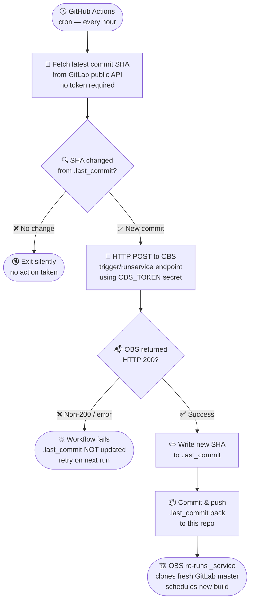

# 🔄 openrgb-obs-watcher

<div align="center">

[](https://github.com/itachi-re/openrgb-obs-watcher/actions/workflows/watch-and-build.yml)
[](https://build.opensuse.org/package/show/home:itachi_re/openrgb)
[](https://gitlab.com/CalcProgrammer1/OpenRGB)
[](LICENSE)
[](https://github.com/itachi-re/openrgb-obs-watcher/commits/main)

<br/>

**A zero-touch GitHub Actions bridge that keeps your OBS-packaged OpenRGB builds perpetually fresh — no manual intervention, no stale sources.**

<br/>

```
 GitLab master ──► GitHub Actions (hourly) ──► OBS trigger ──► Fresh build
                        ↑                            |
                        └──── SHA tracking ──────────┘
```

</div>

---

## 📖 Table of Contents

- [Why this exists](#-why-this-exists)
- [How it works](#-how-it-works)
- [One-time setup](#️-one-time-setup)
  - [1. Create the OBS token](#1--create-the-obs-token)
  - [2. Add GitHub Secrets](#2--add-github-secrets)
  - [3. Enable workflow write permissions](#3--enable-workflow-write-permissions)
  - [4. Push and you're done](#4--push-and-youre-done)
- [Repository structure](#-repository-structure)
- [Adjusting the schedule](#-adjusting-the-schedule)
- [Failure behaviour & safety model](#-failure-behaviour--safety-model)
- [FAQ](#-faq)
- [Links](#-links)

---

## 🤔 Why this exists

OBS's built-in `_service` file (`obs_scm`) can re-fetch the latest upstream source — **but only when manually triggered or when the package itself changes.** This means your locally-hosted OpenRGB package can silently fall days or weeks behind the GitLab `master` branch without anyone noticing.

`openrgb-obs-watcher` solves this with a minimal, self-contained GitHub Actions workflow:

| Without this watcher | With this watcher |
|---|---|
| 🔴 OBS builds only when manually poked | 🟢 OBS builds within an hour of every upstream commit |
| 🔴 Stale source possible for days | 🟢 Source is always the latest GitLab `master` |
| 🔴 Requires developer attention | 🟢 Fully autonomous after one-time setup |

> This approach requires **no GitLab token**, no webhooks on the upstream repo, and no third-party services — just the GitLab public API and your existing OBS account.

---

## ⚙️ How it works



### Step-by-step breakdown

1. **Fetch** — The workflow hits `gitlab.com/api/v4/projects/.../repository/branches/master` (public endpoint, no auth required) and extracts `commit.id`.
2. **Compare** — The returned SHA is diff'd against the content of `.last_commit` stored in this repo.
3. **No change** → workflow exits immediately and silently. No OBS calls are made.
4. **Changed** → a single `POST` with your `OBS_TOKEN` in the `Authorization` header hits the OBS trigger endpoint, causing OBS to re-run the `_service` file, re-clone the GitLab repo at its latest `HEAD`, and queue a fresh build.
5. **Persist** — The new SHA is written to `.last_commit`, committed with a `[bot]` message, and pushed back. The next hourly run will see this SHA and skip silently unless yet another commit has landed upstream.

---

## 🛠️ One-time setup

> **Total time:** ~5 minutes  
> **Prerequisites:** An OBS account with `osc` configured and your `home:itachi_re:openrgb` project already created.

---

### 1 — Create the OBS token

Generate a package-scoped trigger token using `osc`. Package-scoped tokens can only trigger builds for the specified package — safer than a global token.

```bash
osc token --create home:itachi_re:openrgb openrgb
# Output: <token id="..." string="TOKEN_STRING_HERE" .../>
# ⚠️  Copy TOKEN_STRING_HERE — it will not be shown again.
```

**Verify the token works before continuing:**

```bash
curl -sf \
  -H "Authorization: Token YOUR_TOKEN_STRING" \
  -X POST \
  "https://build.opensuse.org/trigger/runservice?project=home:itachi_re:openrgb&package=openrgb" \
  && echo "✅ Token works!" || echo "❌ Something went wrong"
```

A `✅` response means OBS accepted the trigger and will re-run your `_service`. If you see `❌`, double-check the project/package names and token string.

---

### 2 — Add GitHub Secrets

Navigate to your repository: **Settings → Secrets and variables → Actions → New repository secret**

| Secret name | Example value | Description |
|---|---|---|
| `OBS_TOKEN` | `abc123xyz...` | The token string printed by `osc token --create` |
| `OBS_PROJECT` | `home:itachi_re:openrgb` | Full OBS project name containing the package |
| `OBS_PACKAGE` | `openrgb` | The package name inside the OBS project |

<details>
<summary>📷 Step-by-step screenshot guide</summary>

<br/>

1. Open your repository on GitHub and click the **Settings** tab (top navigation bar).
2. In the left sidebar, expand **Secrets and variables** → click **Actions**.
3. Click the green **New repository secret** button (top right).
4. Enter the **Name** (e.g. `OBS_TOKEN`) and paste the **Secret** value.
5. Click **Add secret**. The value is now encrypted and only accessible to workflow runs.
6. Repeat for `OBS_PROJECT` and `OBS_PACKAGE`.

</details>

---

### 3 — Enable workflow write permissions

By default, GitHub Actions tokens are read-only. The watcher needs write access to commit the updated `.last_commit` file back to this repo.

- Go to **Settings → Actions → General**
- Scroll to **Workflow permissions**
- Select **Read and write permissions**
- Click **Save**

> **Security note:** This only grants write access to *this* repository. The token is ephemeral, scoped per-run, and cannot be extracted from workflow logs.

---

### 4 — Push and you're done

```bash
git add .
git commit -m "chore: initial watcher setup"
git push origin main
```

The workflow will run on its hourly schedule automatically. To trigger a manual test run immediately:

1. Open the **Actions** tab in your repository.
2. Select **Watch OpenRGB → Trigger OBS Build** from the left sidebar.
3. Click **Run workflow** → **Run workflow** (green button).
4. Watch the logs — if a new upstream commit exists, you'll see the OBS trigger fire in real time.

---

## 📁 Repository structure

```
openrgb-obs-watcher/
│
├── .github/
│   └── workflows/
│       └── watch-and-build.yml   # The complete watcher — fetch, compare, trigger, persist
│
└── .last_commit                  # Single-line file: SHA of the last upstream commit
                                  # that successfully triggered an OBS build.
                                  # Auto-managed by the workflow — do not edit manually.
```

**That's it.** Two files. No dependencies, no npm, no Docker, no external services beyond GitHub Actions, the GitLab public API, and OBS.

---

## 🕒 Adjusting the schedule

The cron expression lives at the top of `.github/workflows/watch-and-build.yml`:

```yaml
on:
  schedule:
    - cron: '0 * * * *'       # ← every hour on the hour (default)
  workflow_dispatch:           # ← allows manual runs from the Actions tab
```

Common alternatives:

```yaml
# Every 30 minutes
- cron: '*/30 * * * *'

# Every 2 hours
- cron: '0 */2 * * *'

# Twice a day (midnight and noon UTC)
- cron: '0 0,12 * * *'

# Once a day at 06:00 UTC
- cron: '0 6 * * *'
```

> ⚠️ **GitHub scheduling caveat:** Scheduled workflows can be delayed by several minutes (sometimes longer) during periods of high GitHub Actions load. For most packaging use cases this is perfectly acceptable — a 10-minute delay on an hourly check still keeps builds far fresher than any manual process.

> ⚠️ **Inactivity caveat:** GitHub automatically disables scheduled workflows in repositories with **no activity for 60 days**. Re-enable from the Actions tab if this happens.

---

## ❌ Failure behaviour & safety model

The watcher is designed around a single principle: **never leave `.last_commit` in an inconsistent state.**

| Failure scenario | What happens to `.last_commit` | Effect |
|---|---|---|
| GitLab API unreachable / rate-limited | ❌ Not updated | Safe retry next run |
| GitLab API returns unexpected JSON | ❌ Not updated | Safe retry next run |
| OBS trigger returns non-200 | ❌ Not updated | Safe retry next run |
| OBS trigger succeeds, `git push` fails | ✅ Already triggered on OBS | Harmless duplicate build on next successful push |
| Everything succeeds | ✅ Updated with new SHA | Normal operation |

The worst-case outcome is a **duplicate OBS build** for the same upstream commit — harmless. There is no scenario where a new commit is silently skipped forever or where the watcher gets stuck in a broken state.

---

## ❓ FAQ

<details>
<summary><strong>Does this need a GitLab token?</strong></summary>

No. The GitLab branch info endpoint (`/api/v4/projects/:id/repository/branches/:branch`) is public for public projects. OpenRGB's repository is public, so no authentication is required.

</details>

<details>
<summary><strong>What if OpenRGB moves to a different branch?</strong></summary>

Update the branch name in the `curl` call inside `watch-and-build.yml` — change `master` to whatever the new default branch is called.

</details>

<details>
<summary><strong>Can I watch multiple packages?</strong></summary>

Yes. Duplicate the workflow file and adjust the GitLab project URL, OBS secrets, and `.last_commit` filename (e.g. `.last_commit_pkgname`) for each package. Each watcher is fully independent.

</details>

<details>
<summary><strong>Will this work if my OBS package uses a different source service?</strong></summary>

The trigger endpoint is service-agnostic — OBS will re-run whatever `_service` file is present in your package, regardless of the service type. It works with `obs_scm`, `tar_scm`, `download_url`, etc.

</details>

<details>
<summary><strong>How do I stop the watcher without deleting the repo?</strong></summary>

Go to **Actions → Watch OpenRGB → Trigger OBS Build → ⋯ (three dots menu) → Disable workflow**. Re-enable it the same way when ready.

</details>

---

## 🔗 Links

| Resource | URL |
|---|---|
| OpenRGB upstream (GitLab) | https://gitlab.com/CalcProgrammer1/OpenRGB |
| OBS package (home:itachi_re) | https://build.opensuse.org/package/show/home:itachi_re/openrgb |
| OBS token API docs | https://openbuildservice.org/help/manuals/obs-user-guide/cha.obs.source_service.html |
| GitHub Actions cron syntax | https://docs.github.com/en/actions/writing-workflows/choosing-when-your-workflow-runs/events-that-trigger-workflows#schedule |
| `osc` CLI reference | https://en.opensuse.org/openSUSE:OSC |

---

<div align="center">

**Built with ❤️ for the openSUSE community**

*Contributions, issues, and PRs are welcome.*

[](https://github.com/itachi-re/openrgb-obs-watcher/issues)
[](https://github.com/itachi-re/openrgb-obs-watcher/pulls)

</div>
